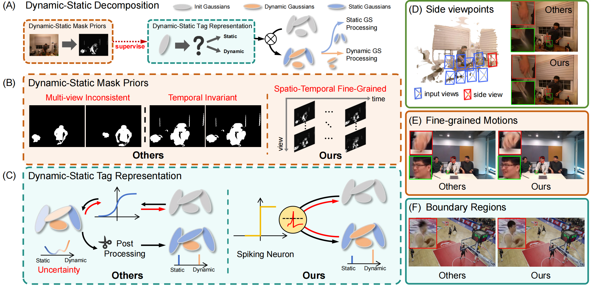

# Dynamic-Static Decomposition for Novel View Synthesis of Dynamic Scenes with Spiking Neurons

Official code for CVPR 2026 Paper "Dynamic-Static Decomposition for Novel View Synthesis of Dynamic Scenes with Spiking Neurons". Homepage at https://zju-bmi-lab.github.io/SpikeMaskGS-homepage.



## Environmental Setups and Data Preparation

Please follow the [Swift4D](https://github.com/WuJH2001/swift4d) to install the relative packages and prepare datasets.

**Mask Priors generated by 4D Mask Field: to be released.**

## Training

For training dynerf scenes such as `cut_roasted_beef`, run
```python
# First, extract the frames of each video.
python scripts/preprocess_dynerf.py --datadir data/dynerf/cut_roasted_beef
# Second, generate point clouds from input data.
bash colmap.sh data/dynerf/cut_roasted_beef llff
# Third, downsample the point clouds generated in the second step.
python scripts/downsample_point.py data/dynerf/cut_roasted_beef/colmap/dense/workspace/fused.ply data/dynerf/cut_roasted_beef/points3D_downsample2.ply
# Finally, train.
python train.py -s data/dynerf/cut_roasted_beef --port 6017 --expname "dynerf/cut_roasted_beef" --configs arguments/dynerf/cut_roasted_beef.py --robust --tracker
```

## Rendering

Run the following script to render the images.

```
python render.py --model_path output/dynerf/cut_roasted_beef --skip_train --skip_video --iteration 13000 --configs  arguments/dynerf/cut_roasted_beef.py
```

## Evaluation

You can just run the following script to evaluate the model.

```
python metrics.py --model_path output/dynerf/coffee_martini/
```
